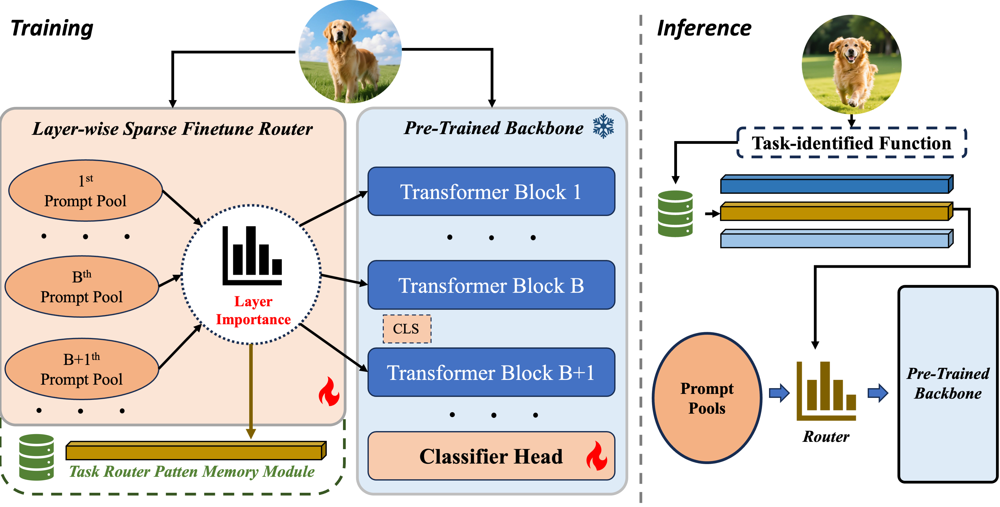

# LiEPrompt: Layer-wise Importance Expandable Prompt for Pre-trained Model-based Class-Incremental Learning
Class-incremental learning (CIL) requires deep learning systems to acquire new knowledge without accessing previous data while retaining previous information. Recently, prompt-based CIL methods have demonstrated strong potential by constructing prompt pools composed of trainable key–prompt pairs and selecting prompts based on the similarity between input embeddings and keys. However, existing methods lack flexible strategies when confronted with streaming tasks. In particular, prompts are prone to being overwritten, pools are not expandable, and the prompt-tuning layer indices are fixed. These limitations lead to severe forgetting and prevent models from adaptively adjusting their training strategies to downstream tasks, resulting in performance degradation. To this end, we propose LiEPrompt, a Layer—wise Importance Expandable Prompt framework. Specifically, we introduce a lightweight layer importance routing module that dynamically estimates the importance of prompts at each transformer layer during training, enabling layer-aware, soft-weighted sparse fine tuning. To preserve task-specific routing behaviors, we further design a task routing pattern memory that stores routing parameters after training and restores routing patterns. Building upon this, we propose an expandable prompt pool to prevent overwriting learned information while enhancing the capacity to learn new tasks. Guided by importance scores, prompts at the most important layers are selectively frozen and expanded, effectively addressing the stability–plasticity dilemma. Overall, LiEPrompt achieves sparse fine-tuning, task-aware routing memory, and adaptive expansion of model representations, leading to improved discriminability and enhanced resistance to catastrophic forgetting. Extensive experiments on multiple benchmarks demonstrate the superiority of LiEPrompt, particularly under long-sequence incremental learning settings.


### Dataset
We provide the processed datasets as follows:
- **CIFAR100**: will be automatically downloaded by the code.
- **CUB200**:  Google Drive: [link](https://drive.google.com/file/d/1XbUpnWpJPnItt5zQ6sHJnsjPncnNLvWb/view?usp=sharing) or Onedrive: [link](https://entuedu-my.sharepoint.com/:u:/g/personal/n2207876b_e_ntu_edu_sg/EVV4pT9VJ9pBrVs2x0lcwd0BlVQCtSrdbLVfhuajMry-lA?e=L6Wjsc)
- **ImageNet-R**: Google Drive: [link](https://drive.google.com/file/d/1SG4TbiL8_DooekztyCVK8mPmfhMo8fkR/view?usp=sharing) or Onedrive: [link](https://entuedu-my.sharepoint.com/:u:/g/personal/n2207876b_e_ntu_edu_sg/EU4jyLL29CtBsZkB6y-JSbgBzWF5YHhBAUz1Qw8qM2954A?e=hlWpNW)
- **ImageNet-A**: Google Drive: [link](https://drive.google.com/file/d/19l52ua_vvTtttgVRziCZJjal0TPE9f2p/view?usp=sharing) or Onedrive: [link](https://entuedu-my.sharepoint.com/:u:/g/personal/n2207876b_e_ntu_edu_sg/ERYi36eg9b1KkfEplgFTW3gBg1otwWwkQPSml0igWBC46A?e=NiTUkL)
- **VTAB**: Google Drive: [link](https://drive.google.com/file/d/1xUiwlnx4k0oDhYi26KL5KwrCAya-mvJ_/view?usp=sharing) or Onedrive: [link](https://entuedu-my.sharepoint.com/:u:/g/personal/n2207876b_e_ntu_edu_sg/EQyTP1nOIH5PrfhXtpPgKQ8BlEFW2Erda1t7Kdi3Al-ePw?e=Yt4RnV)

You need to modify the path of the datasets in `./utils/data.py`  according to your own path.


## Running scripts

Please follow the settings in the `exps` folder to prepare json files, and then run:

```
python main.py --config ./exps/[datasets]/[filename].json
```

**Here is an example of how to run the code** 

if you want to run the cifar dataset using ViT-B/16-IN1K, you can follow the script: 
```
python main.py --config ./exps/cifar/mote.json
```

if you want to run the cifar dataset using ViT-B/16-IN21K, you can follow the script: 
```
python main.py --config ./exps/cifar/mote_in21k.json
```


## Acknowledgment

We would like to express our gratitude to the following repositories for offering valuable components and functions that contributed to our work.

- [PILOT: A Pre-Trained Model-Based Continual Learning Toolbox](https://github.com/sun-hailong/LAMDA-PILOT)